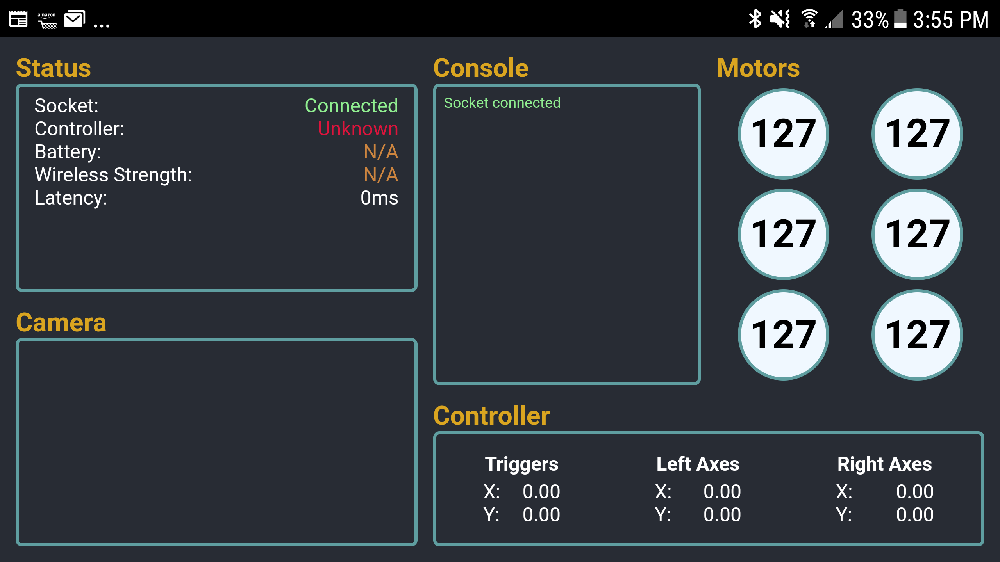

# Hornet
A simple NodeJS project that makes Raspberry Pi's fly 

The home of a future standalone app for the [repo](https://github.com/bizbink/hornet) containing code that gives the 
swarm functionality :smirk:

